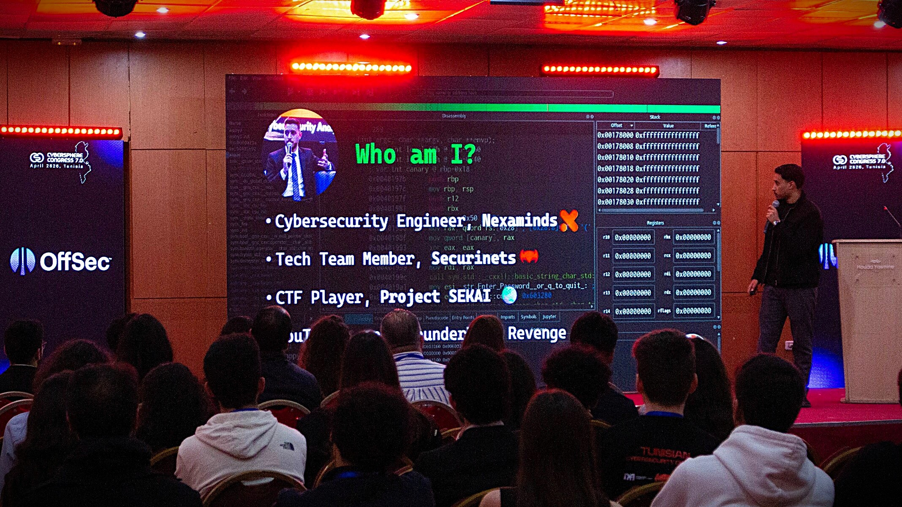

🛡️ I am a **Cybersecurity Researcher** with 4+ years of experience, focusing on  **Reverse Engineering** and  **Android Security**. Currently, I work at [Securinets](https://www.linkedin.com/company/securinets) as a Capture The Flag (CTF) author and instructor.

💼 Previously, I was a **Cybersecurity Instructor** at [Internews](https://internews.org). I also teach programming and hacking at [Blade Club](https://www.facebook.com/bladeclub.tn).

🏫 I am currently studying Cybersecurity at [TEK-UP University](https://www.linkedin.com/school/tek-up-university), where I focus on topics such as computer architecture, algorithms, and my favorite: low-level programming.
